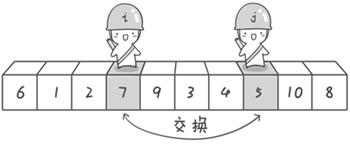

# 快速排序Quick_Sort
快速排序的基本思想：通过一趟排序将待排记录分隔成独立的两部分，其中一部分记录的关键字均比另一部分的关键字小，则可分别对这两部分记录继续进行排序，以达到整个序列有序。

## 算法描述
快速排序使用分治法来把一个串（list）分为两个子串（sub-lists）。具体算法描述如下：

1. 从数列中挑出一个元素，称为 “基准”（pivot）；
2. 重新排序数列，所有元素比基准值小的摆放在基准前面，所有元素比基准值大的摆在基准的后面（相同的数可以到任一边）。在这个分区退出之后，该基准就处于数列的中间位置。这个称为分区（partition）操作；
3. 递归地（recursive）把小于基准值元素的子数列和大于基准值元素的子数列排序。

分区部分：可以有很多种方式，目前比较熟知的是单路、双路、三路；

单路快速排序：

双路快速排序：
基准值和探针值交换值的时候都要考虑需不需要交换，
1. 如果是右侧探针第一趟直接和左侧探针汇合都没有找到合适的元素就不能更换则不换位置  否则基准和左侧指针交换值
2. 如果还没有进行比较，生成探针的时候左右探针就已经重合了【片段只有了；两个元素的时候】,需要手动对比基准值和左探针值
3. 在没有交换的时候，分割片段需要以基准值位置为准，交换后则需要以指针位置为准

